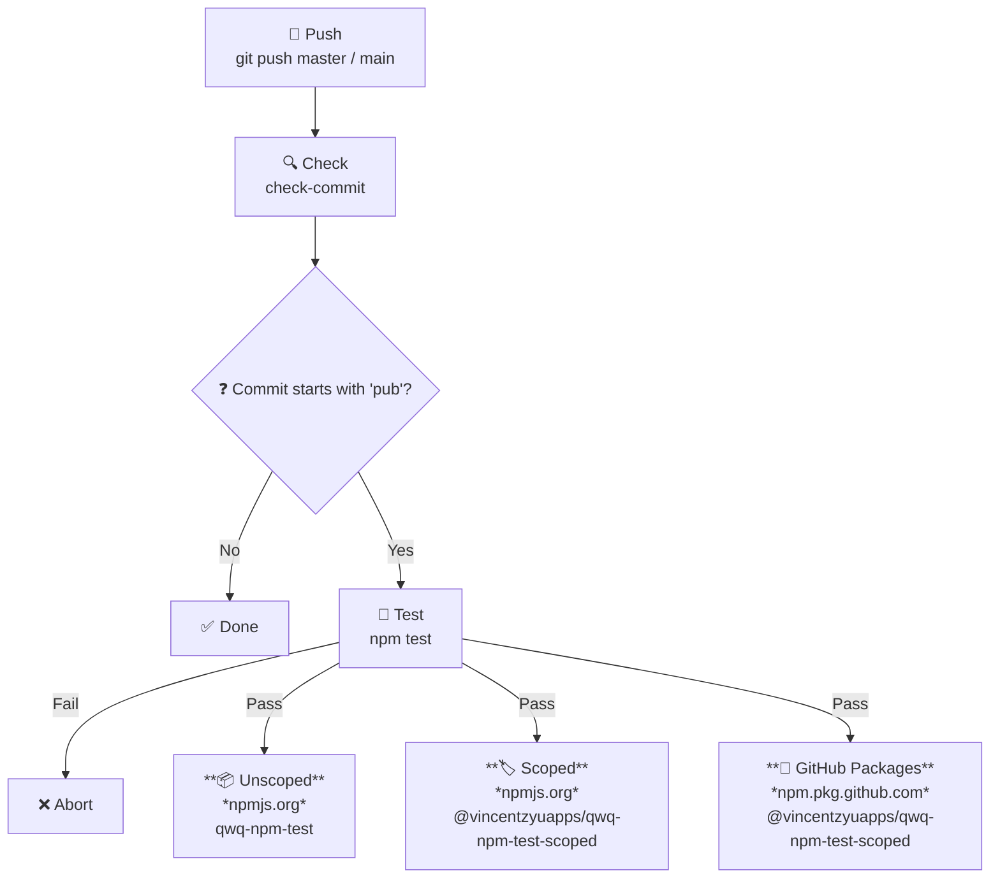

# qwq-npm-test

> 🧪 A sandbox repository for evaluating GitHub Actions CI/CD workflows within the npm ecosystem. 📦

[](https://www.npmjs.com/package/qwq-npm-test)
[](https://www.npmjs.com/package/@vincentzyuapps/qwq-npm-test-scoped)
[](https://github.com/VincentZyuApps/qwq-npm-test/pkgs/npm/qwq-npm-test-scoped)

[](https://github.com/VincentZyuApps/qwq-npm-test/actions/workflows/publish.yml)

---

## 📊 Package Overview

| Registry | Package | Type | Badge |
|---|---|---|---|
| [npmjs.org](https://www.npmjs.com) | [`qwq-npm-test`](https://www.npmjs.com/package/qwq-npm-test) | 📦 npm Unscoped | [](https://www.npmjs.com/package/qwq-npm-test) [](https://www.npmjs.com/package/qwq-npm-test) |
| [npmjs.org](https://www.npmjs.com) | [`@vincentzyuapps/qwq-npm-test-scoped`](https://www.npmjs.com/package/@vincentzyuapps/qwq-npm-test-scoped) | 🏷️ npm Scoped | [](https://www.npmjs.com/package/@vincentzyuapps/qwq-npm-test-scoped) [](https://www.npmjs.com/package/@vincentzyuapps/qwq-npm-test-scoped) |
| [GitHub Packages](https://github.com/features/packages) | [`@vincentzyuapps/qwq-npm-test-scoped`](https://github.com/VincentZyuApps/qwq-npm-test/pkgs/npm/qwq-npm-test-scoped) | 🐙 GitHub Packages Scoped | [](https://github.com/VincentZyuApps/qwq-npm-test/pkgs/npm/qwq-npm-test-scoped) |


## 📚 Package Types Explained

This project publishes **3 packages** across **2 registries**. Here's what each means:

| | 📦 npm Unscoped | 🏷️ npm Scoped | 🐙 GitHub Packages Scoped |
|---|---|---|---|
| **Package name** | `qwq-npm-test` | `@vincentzyuapps/qwq-npm-test-scoped` | `@vincentzyuapps/qwq-npm-test-scoped` |
| **Registry** | [npmjs.org](https://www.npmjs.com) | [npmjs.org](https://www.npmjs.com) | [npm.pkg.github.com](https://npm.pkg.github.com) |
| **Default visibility** | Public | **Private** (need `--access public`) | Private (org-scoped) |
| **Name uniqueness** | Global — first come, first served | Under `@owner` namespace — no conflicts with other orgs | Under GitHub org namespace |
| **Auth** | `NPM_TOKEN` | `NPM_TOKEN` | `GITHUB_TOKEN` |
| **Publish command** | `npm publish` | `npm publish --access public` | `npm publish --registry https://npm.pkg.github.com` |

### 📦 npm Unscoped

Packages without a `@scope` prefix have a **globally unique name** — once `qwq-npm-test` is taken, nobody else can publish under that name. They are **always public** and can be installed with `npm install qwq-npm-test`.

### 🏷️ npm Scoped

Scoped packages follow the format `@owner/package-name`. The name only needs to be unique within your scope, so you don't have to worry about name squatting. However, npm scoped packages are **private by default** — you need `--access public` to share them publicly. Install with `npm install @vincentzyuapps/qwq-npm-test-scoped`.

### 🐙 GitHub Packages Scoped

GitHub Packages also uses npm-compatible scoped names (`@owner/name`), but it points to **GitHub's own registry** (`npm.pkg.github.com`) instead of npmjs.org. It uses `GITHUB_TOKEN` for authentication, which is automatically available in GitHub Actions — no manual token setup needed. Great for keeping packages **private within your organization** while still using `npm install`.

--- 

## 📦 Manual Publish to npm

```bash
# 1. Initialize
npm init -y
# 2. Login to npm (use proxychains or env proxy if needed)
npm login --registry https://registry.npmjs.org
# 3. Create .npmrc in project root, write:
#    //registry.npmjs.org/:_authToken=npm_xxxxx (Access Token from npm website)
echo "//registry.npmjs.org/:_authToken=npm_xxxxx" > .npmrc
# 4. Test
npm test
# 5. Publish unscoped package
npm publish --registry https://registry.npmjs.org
# 6. Publish scoped package
npm pkg set name=@vincentzyuapps/qwq-npm-test-scoped
npm publish --registry https://registry.npmjs.org --access public
# 7. Publish scoped package to GitHub Packages
# ... wait, why not use GitHub Actions CI?
```

## 🤖 Auto Publish via GitHub Actions

> **Prerequisites:** Add these secrets in GitHub repo **Settings → Secrets and variables → Actions → New repository secret**:
> - `NPM_TOKEN` — npm token with publish permission for both `qwq-npm-test` and `@vincentzyuapps/qwq-npm-test-scoped`

```bash
# 1. Init Git repo
git init
git remote add origin git@github.com:VincentZyuApps/qwq-npm-test.git
# 2. Commit and bump version
git add .
git commit -m "chore: save changes before version bump"
npm version patch
# 3. Commit again (message must start with "pub" to trigger publish)
git add .
git commit -m "pub qwq"
# 4. Push
git push -u origin master
```

### 🔑 NPM Token Setup

| Field | Value |
|---|---|
| Token type | Granular Access Token |
| **✔ Bypass 2FA** | **Required** |
| Packages → Permissions | **Read and write** |
| Packages → Scope | **All packages** or include both `qwq-npm-test` and `@vincentzyuapps/qwq-npm-test-scoped` |
| Organizations | No access |
| Expiration | **No expiration** or **90 days** recommended |

> After generating, add `NPM_TOKEN` in GitHub repo **Settings → Secrets and variables → Actions**.

### ⚙️ Notes

When pushing to `master` or `main`, GitHub Actions checks the commit message:

- **starts with `pub`** (case-insensitive) → auto publishes **3 packages** across npmjs.org and GitHub Packages
- **otherwise** → skip

### 🔁 CI Workflow



---

<br>
<br>
<br>
<br>
<br>

