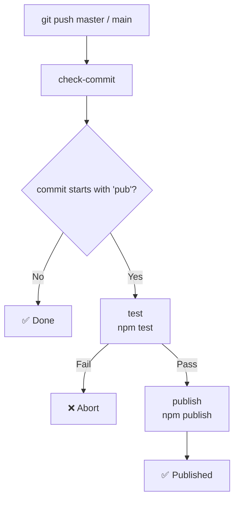

# qwq-npm-test

> test github ci

[](https://www.npmjs.com/package/qwq-npm-test)
[](https://www.npmjs.com/package/qwq-npm-test)

[](https://github.com/VincentZyuApps/qwq-npm-test/actions/workflows/publish.yml)
[](https://github.com/VincentZyuApps/qwq-npm-test)

---

## 📦 Manual Publish to npm

```bash
# 1. Initialize
npm init -y
# 2. Login to npm (use proxychains or env proxy if needed)
npm login --registry https://registry.npmjs.org
# 3. Create .npmrc in project root, write:
#    //registry.npmjs.org/:_authToken=npm_xxxxx (Access Token from npm website)
echo "//registry.npmjs.org/:_authToken=npm_xxxxx" > .npmrc
# 4. Test
npm test
# 5. Publish
npm publish --registry https://registry.npmjs.org
```

## 🤖 Auto Publish via GitHub Actions

> **Note:** First add `NPM_TOKEN` in GitHub repo **Settings → Secrets and variables → Actions → New repository secret**.

```bash
# 1. Init Git repo
git init
git remote add origin git@github.com:VincentZyuApps/qwq-npm-test.git
# 2. Add .npmrc to .gitignore (avoid leaking token)
touch .gitignore
echo ".npmrc" >> .gitignore
# 3. Commit and bump version
git add .
git commit -m "chore: save changes before version bump"
npm version patch
# Or manually update version
# 4. Commit again (message must start with "pub" to trigger publish)
git add .
git commit -m "pub qwq"
# 5. Push
git push -u origin master
```

### 🔑 NPM Token Setup

| Field | Value |
|---|---|
| Token type | Granular Access Token |
| **✔ Bypass 2FA** | **Required** |
| Packages → Permissions | **Read and write** |
| Packages → Scope | **All packages** or select `qwq-npm-test` only |
| Organizations | No access |
| Expiration | **No expiration** or **90 days** recommended |

> After generating, add `NPM_TOKEN` in GitHub repo **Settings → Secrets and variables → Actions**.

### ⚙️ Notes

When pushing to `master` or `main`, GitHub Actions checks the commit message:

- **starts with `pub`** (case-insensitive) → auto runs `npm publish`
- **otherwise** → skip

### 🔁 CI Workflow


