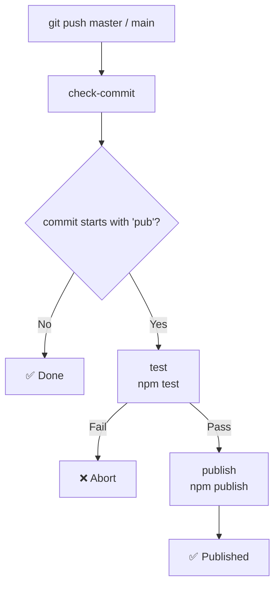

# qwq-npm-test

> test github ci

[](https://www.npmjs.com/package/qwq-npm-test)
[](https://www.npmjs.com/package/qwq-npm-test)

[](https://github.com/VincentZyu233/qwq-npm-test/actions/workflows/publish.yml)
[](https://github.com/VincentZyu233/qwq-npm-test)

---

## 📦 Manual Publish to npm / 手动发布到 npm

```bash
# 1. Initialize / 初始化
npm init -y
# 2. Login to npm (use proxychains or env proxy if needed)
#    登录 npm（需要代理的话可以用 proxychains 或者环境变量）
npm login --registry https://registry.npmjs.org
# 3. Create .npmrc in project root, write:
#    在项目根目录创建 .npmrc，写入：
#    //registry.npmjs.org/:_authToken=npm_xxxxx（Access Token from npm website）
echo "//registry.npmjs.org/:_authToken=npm_xxxxx" > .npmrc
# 4. Test / 测试
npm test
# 5. Publish / 发布
npm publish --registry https://registry.npmjs.org
```

## 🤖 Auto Publish / GitHub Actions 自动发布

> **Note:** First add `NPM_TOKEN` in GitHub repo Settings → Secrets and variables → Actions → New repository secret.

> **注意:** 先在 GitHub 仓库 Settings → Secrets and variables → Actions → New repository secret 中添加 `NPM_TOKEN`（值为 npm 网站的 `npm_...` Access Token）。

```bash
# 1. Init Git repo / 初始化 Git 仓库
git init
git remote add origin git@github.com:VincentZyu233/qwq-npm-test.git
# 2. Add .npmrc to .gitignore (avoid leaking token)
#    忽略 .npmrc（避免泄漏 token）
touch .gitignore
echo ".npmrc" >> .gitignore
# 3. Commit and bump version / 提交并 bump 版本
git add .
git commit -m "chore: save changes before version bump"
npm version patch
# Or manually update version / 或者手动修改版本号
# 4. Commit again (message must start with "pub" to trigger publish)
#    再次提交（commit message 必须以 "pub" 开头才会触发发布）
git add .
git commit -m "pub qwq"
# 5. Push / 推送
git push -u origin master
```

### ⚙️ Notes / 操作提醒

When pushing to `master` or `main`, GitHub Actions checks the commit message:
当 push 到 `master` / `main` 分支时，GitHub Actions 会自动检查 commit message：

- **starts with `pub` / 以 `pub` 开头**（case-insensitive / 不区分大小写）→ auto runs `npm publish` / 自动执行 `npm publish`
- **otherwise / 否则** → skip / 跳过


### 🔁 CI Workflow / CI 流程图


